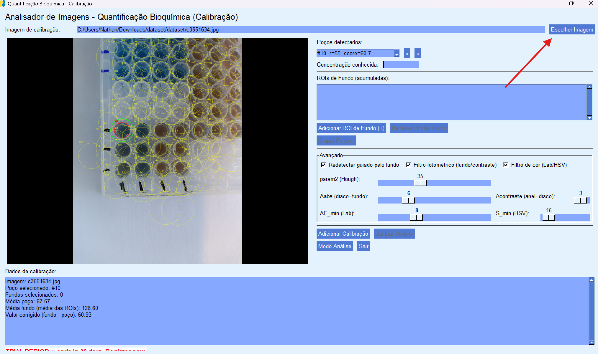
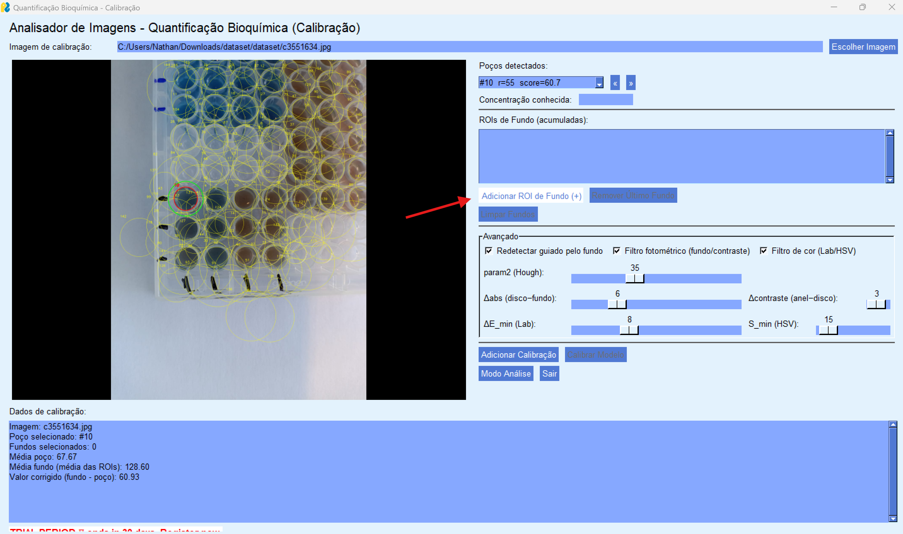
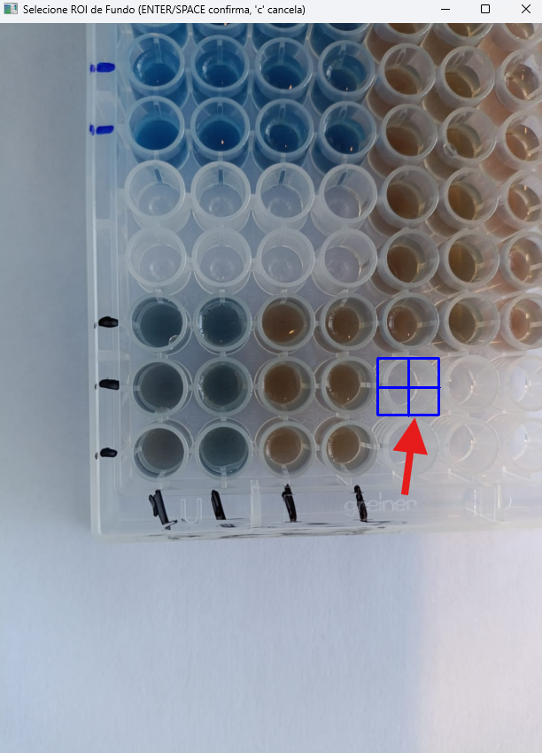
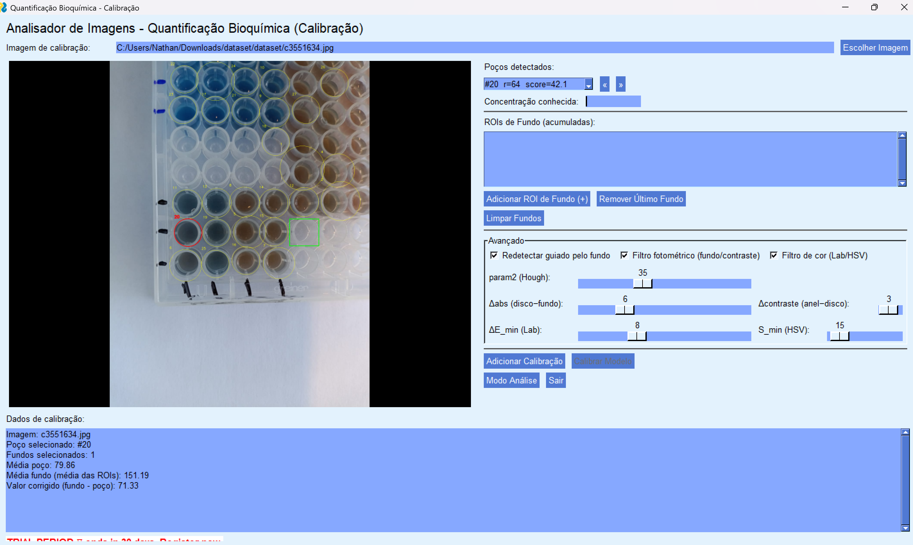
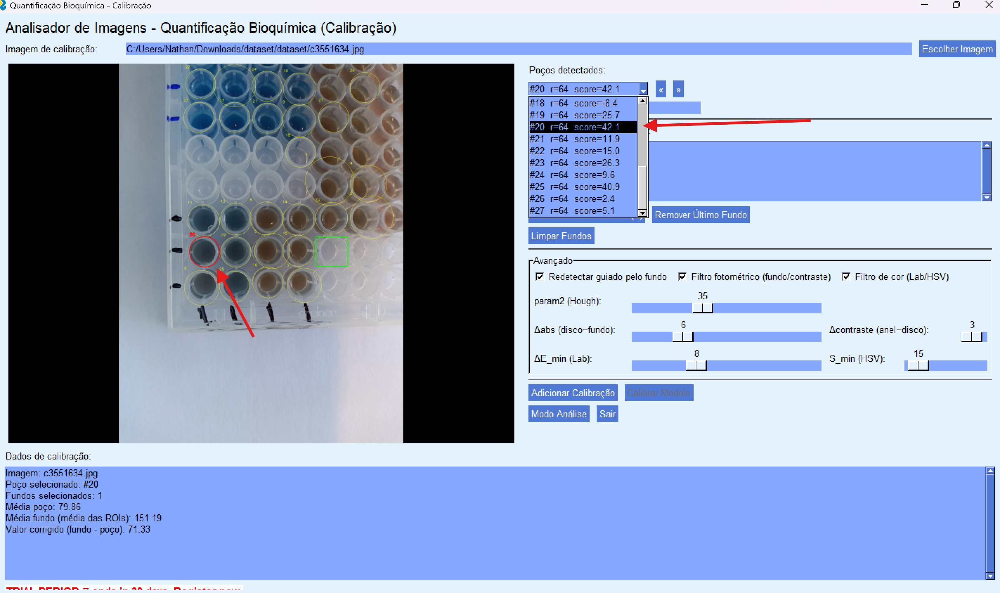
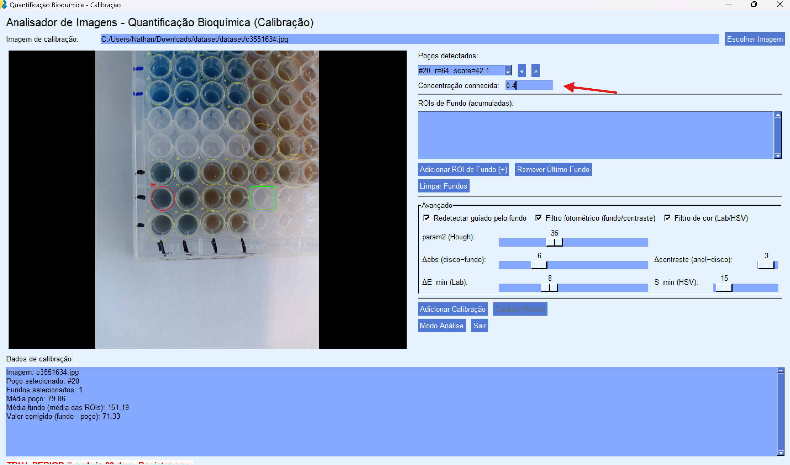
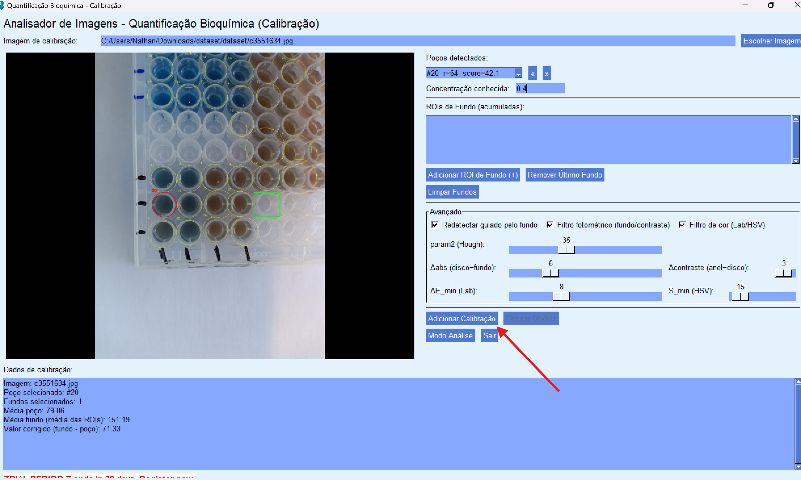

# Analisador de Imagens para Quantificação Bioquímica

## Descrição do Projeto

Este projeto implementa um sistema para análise quantitativa de ensaios de Bradford, permitindo a extração de dados quantitativos de imagens digitalizadas de reações colorimétricas entre proteínas e reagente de Bradford. A aplicação possibilita ao usuário carregar imagens, definir regiões de interesse (ROI), calibrar um modelo com base em imagens padrão e analisar amostras desconhecidas para prever concentrações de proteína.

## Funcionalidades

### Fase de Calibração
- Carregamento de imagens de calibração
- Detecção automática de círculos (poços) usando Transformada de Hough
- Definição de múltiplas ROIs de fundo para correção de iluminação
- Sistema avançado de filtragem de poços (fotométrico e cromático)
- Redetecção guiada por ROIs de fundo
- Armazenamento de pares (intensidade corrigida, concentração)
- Calibração de modelo de regressão linear

### Fase de Análise
- Análise individual de imagens desconhecidas
- Aplicação automática de ROIs e filtros definidos na calibração
- Processamento em lote de pastas inteiras
- Predição de concentrações usando o modelo calibrado
- Geração de arquivo CSV com resultados

## Estrutura do Projeto

### Arquivos Principais

#### `main.py`
- **Responsabilidade**: Ponto de entrada da aplicação
- **Função**: Inicializa a interface gráfica e coordena o fluxo principal do programa

#### `gui.py`
- **Responsabilidade**: Interface gráfica completa usando PySimpleGUI
- **Funções principais**:
  - Implementa janelas de Calibração e Análise
  - Gerencia eventos de usuário e navegação entre modos
  - Controla painéis avançados com parâmetros configuráveis
  - Integra visualização de imagens com overlays
  - Coordena o fluxo entre detecção, seleção e análise

#### `image_loader.py`
- **Responsabilidade**: Carregamento e validação de imagens
- **Funções principais**:
  - Carrega imagens usando OpenCV
  - Valida formatos suportados (.png, .jpg, .jpeg)
  - Trata erros de carregamento e arquivos corrompidos

#### `roi_selector.py`
- **Responsabilidade**: Detecção e seleção de regiões de interesse
- **Funções principais**:
  - **Detecção de poços**: Implementa HoughCircles com parâmetros otimizados
  - **Pontuação por contraste**: Avalia qualidade dos círculos detectados (anel - disco)
  - **Seleção manual de ROIs**: Interface OpenCV para seleção de poços e fundos
  - **Cálculo de médias**: Processa intensidades em ROIs circulares e retangulares
  - **Filtros avançados**:
    - Fotométrico: Remove poços similares ao fundo
    - Cromático: Filtra por assinatura de cor (Lab/HSV)
  - **Redetecção guiada**: Usa ROIs de fundo para melhorar detecção
  - **Visualização**: Desenha overlays com poços e fundos selecionados

#### `regression_model.py`
- **Responsabilidade**: Modelo de calibração e predição
- **Funções principais**:
  - Armazena pares (intensidade, concentração) de calibração
  - Implementa regressão linear usando scikit-learn
  - Calcula coeficiente de determinação R²
  - Realiza predições em novas amostras
  - Valida estado de calibração do modelo

#### `utils.py`
- **Responsabilidade**: Utilitários de processamento de imagem
- **Funções principais**:
  - Converte imagens BGR para escala de cinza
  - Redimensiona imagens mantendo proporção
  - Converte imagens OpenCV para formato PySimpleGUI
  - Funções auxiliares de manipulação de imagem

## Requisitos do Sistema

### Bibliotecas Python
- **PySimpleGUI**: Interface gráfica interativa
- **OpenCV**: Processamento de imagens e detecção de círculos
- **NumPy**: Operações matemáticas e manipulação de arrays
- **scikit-learn**: Modelo de regressão linear
- **typing**: Anotações de tipo (Python < 3.9)

### Instalação
```bash
pip install PySimpleGUI opencv-python numpy scikit-learn
```

## Como Usar

### 1. Executar a Aplicação
```bash
python src/main.py
```

### 2. Modo Calibração

#### Passo 1: Seleção da Imagem de Calibração
Clique em "Escolher Imagem" para carregar uma imagem de calibração.


*Botão para selecionar imagem de calibração*

#### Passo 2: Configuração de ROI de Fundo
Para remover círculos detectados automaticamente que não possuem reagentes:


*Botão para selecionar região de interesse de fundo*


*Interface para seleção da região de fundo na imagem*


*Imagem após remoção dos círculos indesejados*

#### Passo 3: Seleção de Poços
Use a lista de poços detectados para selecionar o poço desejado. O poço selecionado será destacado com um círculo vermelho na imagem.


*Lista de poços detectados e visualização do poço selecionado*

#### Passo 4: Adição da Concentração
Digite a concentração conhecida correspondente ao poço selecionado.


*Campo para inserir a concentração do reagente do poço selecionado*

#### Passo 5: Adicionar Calibração
Após inserir a concentração, clique em "Adicionar Calibração" para armazenar o ponto de calibração.


*Botão para adicionar a calibração do poço atual*

#### Passo 6: Calibrar Modelo
Repita os passos 1-5 para múltiplas imagens de calibração. Após ter pelo menos 6 poços calibrados, clique em "Calibrar Modelo" para treinar o sistema de predição.

### 3. Modo Análise
1. Clique em "Modo Análise" após calibrar o modelo
2. Carregue imagens individuais ou processe pastas inteiras
3. O sistema aplicará automaticamente as ROIs e filtros da calibração
4. Visualize as predições na interface ou no arquivo CSV gerado

## Características Técnicas

### Detecção Automática de Poços
- Utiliza cv2.HoughCircles com parâmetros otimizados por tamanho da imagem
- Sistema de pontuação por contraste (anel externo - disco interno)
- Limites adaptativos de raio baseados nas dimensões da imagem

### Correção de Fundo
- Suporte a múltiplas ROIs de fundo
- Correção por subtração: intensidade_corrigida = fundo - poço
- ROI automática (anel) ou manual (retângulo selecionável)

### Filtros Avançados
- **Fotométrico**: Remove poços com baixa diferença em relação ao fundo
- **Cromático**: Filtra por assinatura de cor usando espaços Lab e HSV
- **Redetecção guiada**: Usa estatísticas do fundo para melhorar HoughCircles

### Interface Responsiva
- Layout em duas colunas redimensionável
- Pré-visualização com aspect ratio preservado
- Controles avançados com sliders para parâmetros
- Navegação intuitiva entre poços detectados

## Conformidade com Requisitos Acadêmicos

Este projeto atende aos requisitos da disciplina GBC213 - Multimídia da UFU:

- ✓ Interface gráfica com PySimpleGUI
- ✓ Detecção automática de círculos com Transformada de Hough
- ✓ Definição interativa de ROIs
- ✓ Correção de fundo com ROI secundária
- ✓ Pipeline completo de calibração e análise
- ✓ Processamento em lote com geração de CSV
- ✓ Modelo de regressão linear para predições

## Estrutura de Arquivos
```
projeto/
├── src/
│   ├── main.py                 # Ponto de entrada
│   ├── gui.py                  # Interface gráfica
│   ├── image_loader.py         # Carregamento de imagens
│   ├── roi_selector.py         # Detecção e seleção de ROIs
│   ├── regression_model.py     # Modelo de calibração
│   └── utils.py               # Utilitários
├── dataset/                   # Imagens de teste (se disponível)
├── diretriz/
│   └── ufu_GBC213_Projeto.pdf # Especificação do projeto
└── README.md                  # Este arquivo
```

## Desenvolvido para
**Universidade Federal de Uberlândia**  
**Disciplina**: GBC213 - Multimídia  
**Bacharelado em Ciência da Computação**